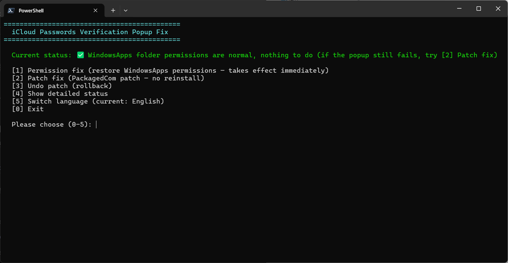

# iCloud Passwords Verification Code Popup Fix Tool

> [English](README.en.md) | 简体中文

Fixes the issue where the verification code popup does not appear in the iCloud Passwords browser extension for Windows.
No Apple files need to be modified. This tool only restores WindowsApps folder permissions or adds the missing registry entries (two repair methods).
Supports one-click repair / undo / status check.

## Table of Contents

- [Symptoms](#symptoms)
- [Quick Start](#quick-start)
- [How to Use](#how-to-use)
- [Root Cause](#root-cause)
- [How the Fix Works](#how-the-fix-works)
- [Registry Changes](#registry-changes)
- [Script Design Details](#script-design-details)
- [Compatibility and Limitations](#compatibility-and-limitations)
- [Known Issues](#known-issues)
- [How to Verify the Fix](#how-to-verify-the-fix)
- [License](#license)

---

## Symptoms

After clicking the iCloud Passwords extension icon in Edge/Chrome:

1. The extension shows the verification code input interface ("iCloud has sent you a notification containing a verification code").
2. However, the **verification code popup** (a small window displaying a 6-digit number, a `#32770` dialog) **never appears**.
3. After about 20–30 seconds, the extension reports: `"Enable "Passwords" in iCloud for Windows to use iCloud Passwords with Edge"`.

**Trigger condition**: iCloud will fail if it is installed/reinstalled while the **WindowsApps folder permissions have been elevated** (a normal user has been granted Full Control). You do not need to uninstall and reinstall; the first installation while permissions are elevated triggers the issue as well.
Machines with normal permissions are unaffected. **The reverse is also true**: restoring the original permissions takes effect immediately, without reinstalling.

## Quick Start

**Simply double-click `run_patch.bat` (automatically requests administrator privileges).**

```powershell
# Open "Terminal (Administrator)" or "Windows PowerShell (Administrator)":
pwsh -File patch_icloud_secd_com.ps1        # Interactive menu (recommended)
pwsh -File patch_icloud_secd_com.ps1 -Cure  # Permission repair
pwsh -File patch_icloud_secd_com.ps1 -Fix   # Patch repair
pwsh -File patch_icloud_secd_com.ps1 -Undo  # Undo patch
```

You can also right-click and select **Run with PowerShell** (the script is compatible with both PS 5.1 and PS 7). **The script does not auto-elevate**:
when run without administrator privileges, it only displays a prompt; use `run_patch.bat` or open an administrator shell yourself.

**The UI language follows the system automatically** (Chinese UI on Chinese systems, English otherwise); use `-Lang zh` / `-Lang en` to force one (same via `run_patch.bat zh` / `run_patch.bat en`).

## How to Use

### Run Methods

| Method | Command |
|---|---|
| Double-click launcher (recommended, auto-elevate + bypass execution policy; uses the built-in Windows PowerShell 5.1) | `run_patch.bat` |
| Interactive menu (administrator required) | `pwsh -File patch_icloud_secd_com.ps1` |
| Permission repair (administrator required, takes effect immediately) | `pwsh -File patch_icloud_secd_com.ps1 -Cure` |
| Patch repair (administrator required) | `pwsh -File patch_icloud_secd_com.ps1 -Fix` |
| Undo patch (administrator required) | `pwsh -File patch_icloud_secd_com.ps1 -Undo` |

### Interactive Menu



After launching, the tool automatically checks the current state and displays a dual-mode menu:

- **Current status** (detected automatically):
  - `✅ Repaired` — Class registration + State=1 are both present
  - `⚠️ Partially repaired` — Some entries are present (commonly only State or Class is missing)
  - `❌ Not repaired` — All entries are missing (typical after a reinstall)
  - Also shows whether WindowsApps permissions are abnormal and the MSVCP140 (VC++ runtime) version
- **[1] Permission repair**: restore WindowsApps permissions — **takes effect immediately, with no reinstall, reboot, or patch required** (reboot the PC only if absolutely necessary)
- **[2] Patch repair**: add the PackagedCom packaged COM declarations (no reinstall required; the popup is restored immediately)
- **[3] Undo patch**: remove the entries written by the patch (State is retained)
- **[4] Detailed status**: read-only display of Package/Class/Server/TypeLib/Interface/State/permissions/CRT
- **[5] Switch language**: switch between Chinese and English instantly (current session only; the next launch still auto-detects from the system language)
- **[0] Exit**

**Choosing a repair method**: in most cases (WindowsApps permissions were previously elevated), simply use **[1] Permission repair** for an **immediate fix**.
Only use **[2] Patch repair** if permissions are already normal but the issue persists, or if **[1] Permission repair** does not restore the popup.

When running as administrator, [1]/[2]/[3] execute directly. Without administrator privileges, the tool only displays instructions for elevation (use `run_patch.bat` or an administrator shell).

### Repair Output

A successful repair is indicated by `[OK]` on every step followed by `✅ Repair completed`.

### Verify the Result

After repairing, **completely close Edge and reopen it**, then click the extension icon: the verification code popup (showing 6 digits) should appear → enter the code into the extension input field → the value is automatically filled in successfully.

---

## Root Cause

### 1. iCloud's Password Daemon Is a Packaged COM Server

iCloud for Windows is an **MSIX packaged application** (Store package `AppleInc.iCloud`). Its password-management daemon
`secd.exe` (located in `iCloud\secd.exe`) is a **COM server**:

| Identifier | Value |
|---|---|
| CLSID | `{CE6AF8E5-3A75-4AF5-BD59-C42E7228B4F4}` ("SecDaemon Class") |
| Private interface | `{E095A809-7CDD-4B6D-A528-5D4AC9420D91}` (ISecDaemon, method PerformOperation) |
| TypeLib | `{71529314-E4B7-400B-8FD7-9A5F695AF311}` v1.0 (library name secdLib) |

The extension helper process `iCloudPasswordsExtensionHelper.exe` performs the following every time the extension is clicked:

```text
CoCreateInstance(CLSID, CLSCTX_LOCAL_SERVER, IID_E095A809)
→ RPCSS resolves the CLSID → SCM starts secd.exe -Embedding → returns the ISecDaemon interface
→ Calls PerformOperation (PAKE key agreement)
→ On success → locally generates a 6-digit verification code (GeneratePIN) → shows PINDialog (#32770) displaying "xxx xxx"
→ Extension receives {"cmd":2} (ChallengePIN) → shows the input field → user enters the code → verifies → autofills
```

**If any step fails, the verification code popup will not appear.**

### 2. The "Isolated View" of the Registry for Packaged Applications

The registry of MSIX packaged applications (and their COM servers) is **virtualized**: a packaged process sees a merged view of the "real registry + isolated view".
The registration of packaged COM classes lives in the **isolated-view namespace**
`\REGISTRY\COMROOT\CLASSES` (physically stored in the per-application Helium hive in the packaged application data directory,
mounted as `\REGISTRY\WC\SiloXXXcom`; the data is generated during installation and remains mounted) —
**it is not visible to regedit or normal registry APIs**.

The secd registration is embedded in the package payload's `Registry.dat` (generated when Apple packages the app and containing
the complete registration for `CLSID\{CE6AF8E5}='SecDaemon Class'` + `LocalServer32` + `TypeLib={71529314-...}`);
the ATL `.rgs` script embedded in secd is only a runtime fallback and normally does not execute.

### 3. The Actual Root Cause: Installation While Elevated Causes Packaged Registration Mounting to Fail Silently

**Uninstalling/reinstalling by itself does not cause the failure** (VM A/B test: uninstall/reinstall under standard permissions → popup works normally);
**installing while WindowsApps permissions are elevated** → immediate failure (the first installation also triggers it; reinstalling is not required).

Failure mechanism: secd's registration is located in the package's `Registry.dat` under **both working and broken states**
(the file is a **package-payload-embedded** registration baseline, as confirmed by AppxBlockMap; both states are identical and contain the complete SecDaemon Class
+ ISecDaemon marshal + TypeLib registration). The difference is not where the registration is stored, but whether the system mounts the registration
as a packaged COM view that RPCSS can resolve (`\REGISTRY\COMROOT`): the mount step performs a WindowsApps ACL integrity pre-check;
the elevated-permission state fails that check → **mounting is silently skipped** (COMROOT does not exist → `0xC0000034`, rather than Access Denied)
→ the helper's `CoCreateInstance` returns `0x80040154 (CLASSNOTREG)` → it returns `{"cmd":10}` → the popup never appears.
**After restoring the standard ACL, the next resolution attempt mounts the view successfully → the fix takes effect immediately**
(no reinstall/reboot required, and the repaired state persists; later ACL changes/reboots do not affect it).

**Comparison evidence**: on a machine installed with normal permissions, RPCSS can open the CLSID from the isolated view; on the faulty machine,
all resolution paths fail. The remote real registry (HKCR, PackagedCom, HKCU Classes) also contains no such registration —
it exists only in the isolated view.

---

## How the Fix Works

### Key Finding: PackagedCom Is the Materialized Registry Location for Packaged COM Declarations

The `<com:Class>` declarations in the MSIX package manifest (`AppxManifest.xml`) are materialized into the real registry at
`HKLM\SOFTWARE\Classes\PackagedCom\` (readable by SCM/RPCSS). The four COM servers in the iCloud package,
iCloudHome / iCloudDrive / iCloudPhotos / APSDaemon, all rely on **manifest declarations + PackagedCom materialization** —
**only Apple omitted secd** (it relies on the isolated-view registration mount, and that mechanism fails after an elevated-permission installation, as described above).

### Repair Method

Add the missing **"packaged COM declaration"** for secd under `PackagedCom` (emulating the manifest declaration):

```text
HKLM\SOFTWARE\Classes\PackagedCom\Package\AppleInc.iCloud_15.9.60.0_x64__nzyj5cx40ttqa\
├── Class\{CE6AF8E5-3A75-4AF5-BD59-C42E7228B4F4}   ← CLSID declaration (ServerId points to the Server below)
├── Server\5                                        ← ExeServer: Executable=iCloud\secd.exe
├── Interface\{E095A809-7CDD-4B6D-A528-5D4AC9420D91} ← ISecDaemon (UseUniversalMarshaler)
├── TypeLib\{71529314-E4B7-400B-8FD7-9A5F695AF311}\1.0 ← Win32Path=iCloud\secd.exe
└── ClassIndex / InterfaceIndex / TypeLibIndex indexes
```

**Effect** (confirmed by ETW kernel process events): after clicking the extension, RPCSS resolves the CLSID from PackagedCom
and starts secd with the **packaged identity**:

```text
Process 5064 started by parent 1968 (RPCSS/DcomLaunch)
ImageName: ...\AppleInc.iCloud_15.9.60.0_x64__nzyj5cx40ttqa\iCloud\secd.exe
PackageFullName: AppleInc.iCloud_15.9.60.0_x64__nzyj5cx40ttqa   ← packaged identity activation!
```

**This is completely consistent with the behavior on a normal machine** — the helper's `CoCreateInstance` succeeds → PAKE →
`GeneratePIN` → verification code popup appears.

### Why Marshal Registration Is Also Required (HKCU/HKLM TypeLib + Interface)

The helper and secd communicate through a cross-process COM call. Marshaling of the ISecDaemon interface depends on the TypeLib
(Universal Marshaler): `LoadTypeLib` looks up the TLB location from `TypeLib\{71529314}\1.0\0\win32` in the registry,
while `Interface\{E095A809}` provides the TypeLib reference and proxy information. In testing, the helper/secd repeatedly queried
these keys during startup (ETW/ProcMon evidence), and missing entries caused the call to fail. The script therefore fills both
**HKCU + HKLM** so both the packaged process's user view and the system view can resolve them.

### Prerequisite (Patch Repair Only): VC++ Runtime (MSVCP140 ≥ 14.4x)

**This prerequisite only affects patch repair ([2] / `-Fix`)** — permission repair ([1] / `-Cure`) does not depend on the VC++
version, so this section can be ignored for that method.

VM cross-testing: when System32's MSVCP140 (VC++ 2015-2022 runtime)
is **below 14.40**, the helper crashes while processing the verification-code message (0xC0000005, null-pointer dereference in
MSVCP140 `_Mtx_do_lock`, before COM activation), so the patch never gets a chance to take effect.
The script includes a built-in check: when `<14.40`, it warns you to install
[VC++ 2015-2022 Redistributable](https://aka.ms/vs/17/release/vc_redist.x64.exe)
first (on Windows 11 system-component scenarios, Windows Update may be tried first).

### Why CKKS Passwords State = 1 Is Required

This is the enablement switch for the iCloud "Passwords" feature. On a normally installed machine, the application creates this key (`State=1`);
on broken/bad installations the key may be completely missing (VM cross-test: normal CRT + no such key → no popup, because the helper's state gate blocks it;
creating the key and setting it to 1 restores the popup immediately). The script automatically creates the key and sets it to 1 when it is missing.

---

## Registry Changes

**The script only performs "add new keys + change one value"; it does not overwrite any existing Apple registration.**

### Added (11 keys)

| # | Location | Content | Purpose |
|---|---|---|---|
| 1 | `HKLM\...\PackagedCom\Package\<package>\Class\{CE6AF8E5}` | ServerId / DisplayName / DeploymentVersion | CLSID packaged declaration (core) |
| 2 | `...\Server\<N>` (dynamically chosen to avoid conflicts) | Executable=`iCloud\secd.exe`, ApplicationId, TrustLevel=1, RuntimeBehavior=1, BnoIsolation=0, etc. | secd ExeServer definition |
| 3 | `...\Interface\{E095A809}` | UseUniversalMarshaler=1, TypeLibId, TypeLibVersionNumber=1.0 | ISecDaemon interface declaration |
| 4 | `...\TypeLib\{71529314}\1.0` | Win32Path/Win64Path=`iCloud\secd.exe` | TypeLib declaration |
| 5-7 | `PackagedCom\ClassIndex/InterfaceIndex/TypeLibIndex\{GUID}\<package>` | Empty keys | Indexes (used by SCM lookup) |
| 8 | `HKCU\Software\Classes\TypeLib\{71529314}\1.0` | `0\win32`/`0\win64`=absolute path to secd.exe, FLAGS, HELPDIR | TypeLib loading for marshaling |
| 9 | `HKLM\SOFTWARE\Classes\TypeLib\{71529314}\1.0` | Same as above | System-view fallback |
| 10 | `HKCU\Software\Classes\Interface\{E095A809}` | TypeLib={71529314}, TypeLib\Version=1.0, Version=1.0, ProxyStubClsid32={00020424-...} | Interface marshaling resolution |
| 11 | `HKLM\SOFTWARE\Classes\Interface\{E095A809}` | Same as above | System-view fallback |

### Changed (1 value; key created automatically if missing)

| Location | Change |
|---|---|
| `HKCU\...\Internet Services\CKKS\Features\Passwords\State` | Set to 1 (normal installations already have the key and only change its value; broken/reinstalled systems may lack it → the script creates it automatically) |

### What `-Undo` Removes

- Deletes all 11 keys added above (including empty index parent shells)
- **State is retained** (set it back to 0 manually if needed)
- Idempotent: repeating undo is safe; repeating repair reuses the existing ServerId and does not create orphan entries

---

## Script Design Details

- **Multi-language**: UI strings follow the system language (`Get-UICulture`); `-Lang zh|en` forces one (same via `run_patch.bat zh|en`). Values written to the registry stay as English constants (they are the read-back basis for the Undo delete-protection)
- **5.1 compatibility**: `#requires -Version 5.1` + **UTF-8 with BOM** (PowerShell 5.1 reads Chinese scripts without a BOM as ANSI and may parse them incorrectly — this was a real pitfall)
- **Dynamic values**: package name (`Get-AppxPackage`), ServerId (existing maximum +1, or reuse an already registered one), DeploymentVersion (read from the existing Class value), secd.exe path (`InstallLocation`)
- **Interactive menu**: real-time status checks (Class registration / State / marshal completeness / WindowsApps permissions / MSVCP140 version), with options for repair / undo / detailed status / exit;
  command-line modes `-Fix` / `-Cure` / `-Undo` are provided for scripting (exit codes are propagated)
- **Read-back verification**: at the end of Do-Fix, 10 critical registry entries are compared one by one; write failures (silent by default) are detected and highlighted, preventing a "false success"
- **Undo protection**: Do-Undo only removes TypeLib/Interface keys written by this tool (after validating the `(default)` value); existing registrations with the same GUID that predated the patch are not deleted by mistake
- **Multi-package filtering**: `Get-ICloudPackage` filters staged leftover packages (the "deployment amnesia" case) and selects the latest installed version

---

## Compatibility and Limitations

| Item | Tested |
|---|---|
| Windows | 11 Pro 10.0.26100 (24H2) |
| iCloud for Windows | 15.9.60.0 |
| Edge / Chrome | Latest stable versions |
| PowerShell | 5.1 / 7.x |

- The three GUIDs (CLSID/interface/TypeLib) are stable identifiers within the iCloud product line, but **future versions may change them and break the fix**. Please report it if that happens (you can extract the latest values from the `.rgs` embedded in `secd.exe`).
- After an iCloud **upgrade/reinstall**, `PackagedCom` switches to the new version directory → **run the script once again**.
- If the fix still does not work: first check whether all "read-back verification" checks in the script output passed; then check
  `CKKS\Features\Passwords\State` (set it to 1 and restart Edge) and the MSVCP140 version (≥14.40).

---

## Known Issues

- **After using patch repair mode, the popup text may display resource names** (`Dlg_PinTitle` / `Dlg_PinText` / `Dlg_Dismiss`):
  localized strings fail to load through WinRT `ApplicationModel.Resources`, so the runtime falls back to displaying the resource names.
  The PRI resource files are complete (zh-cn/en-US are both present), but the exact reason why runtime loading fails has not been identified
  (on Apple's side). **The verification code and functionality are unaffected**; this is purely a visual issue.

---

## How to Verify the Fix

```powershell
# 1. Registry check (all should be True; State should be 1)
Test-Path "HKLM:\SOFTWARE\Classes\PackagedCom\Package\$((Get-AppxPackage AppleInc.iCloud).PackageFullName)\Class\{CE6AF8E5-3A75-4AF5-BD59-C42E7228B4F4}"
(Get-ItemProperty 'HKCU:\Software\Apple Inc.\Internet Services\CKKS\Features\Passwords').State

# 2. Restart Edge → click the extension icon → the verification code popup (#32770, showing 6 digits) appears
# 3. Enter the verification code → autofill succeeds
```

Workflow: click the extension → helper `CoCreateInstance` (succeeds, secd activated with packaged identity) → PAKE session →
generate 6-digit verification code → PINDialog popup → enter code → verify → autofill.

---

## License

MIT.
