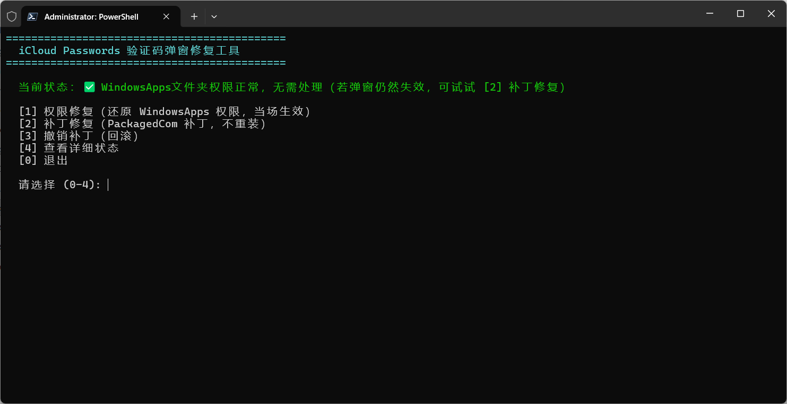

# iCloud Passwords Verification Popup Fix

> [简体中文](README.md) | English

Fixes the "verification code popup never appears" issue with the iCloud Passwords browser extension on Windows.
No Apple files are modified — this tool either restores the WindowsApps folder permissions or patches the registry (two fix modes). One-click **Fix / Undo / Status** modes.

## Contents

- [Symptoms](#symptoms)
- [Quick Start](#quick-start)
- [Usage Guide](#usage-guide)
- [Root Cause](#root-cause)
- [How the Fix Works](#how-the-fix-works)
- [Registry Changes](#registry-changes)
- [Script Design](#script-design)
- [Compatibility & Limitations](#compatibility--limitations)
- [Known Issues](#known-issues)
- [Verifying the Fix](#verifying-the-fix)
- [License](#license)

---

## Symptoms

After clicking the iCloud Passwords extension icon in Edge/Chrome:

1. The extension shows the verification code input UI ("iCloud sent a notification with a verification code to your devices")
2. But the **verification popup** (the small window with a 6-digit code, a `#32770` dialog) **never appears**
3. After ~20–30 s the extension reports: *"Turn on Passwords in iCloud for Windows to use iCloud Passwords with Edge"*

**Trigger condition** (confirmed by VM A/B experiments): installing/reinstalling iCloud **while the WindowsApps folder has elevated permissions** (a normal user granted Full Control) breaks it — no uninstall/reinstall needed, a first install with elevated permissions triggers it too; machines installed with standard permissions are unaffected. **The reverse also holds** (verified on VM): restoring the permissions takes effect immediately — no reinstall needed.

## Quick Start

**Just double-click `run_patch.bat` (it requests admin rights via UAC)**

```powershell
# Open "Terminal (Admin)" / "Windows PowerShell (Admin)", then:
pwsh -File patch_icloud_secd_com.ps1        # interactive menu (recommended)
pwsh -File patch_icloud_secd_com.ps1 -Cure  # permission fix
pwsh -File patch_icloud_secd_com.ps1 -Fix   # patch fix
pwsh -File patch_icloud_secd_com.ps1 -Undo  # undo patch
```

Right-click → "Run with PowerShell" also works (the script is compatible with both PS 5.1 and PS 7). **The script does not self-elevate**: when run without admin rights it only prints a hint — use run_patch.bat or an elevated PowerShell instead.

## Usage Guide

### Running the script

| Mode | Command |
|---|---|
| Double-click launcher (recommended, auto-elevates + bypasses policy) | `run_patch.bat` |
| Interactive menu (admin required) | `pwsh -File patch_icloud_secd_com.ps1` |
| Permission fix (admin required, takes effect immediately) | `pwsh -File patch_icloud_secd_com.ps1 -Cure` |
| Patch fix (admin required) | `pwsh -File patch_icloud_secd_com.ps1 -Fix` |
| Undo patch (admin required) | `pwsh -File patch_icloud_secd_com.ps1 -Undo` |

### Interactive menu



After running, the script detects the current state and shows a menu (dual-mode):

- **Current status** — auto-detected fix state:
  - `✅ Fixed` — Class registration + State=1 all present
  - `⚠️ Partially fixed` — some items present (commonly missing only State or Class)
  - `❌ Not fixed` — everything missing (typical state after reinstall)
  - Also shows WindowsApps permission anomalies and the MSVCP140 (VC++ runtime) version
- **[1] Permission fix** — restores the WindowsApps ACL — **takes effect immediately, no reinstall/reboot/patch needed** (if it does not work right away, try rebooting the PC)
- **[2] Patch fix** — writes PackagedCom packaged-COM declarations (no reinstall; popup works immediately)
- **[3] Undo patch** — deletes the patch entries (State kept)
- **[4] Show details** — read-only: package / Class / Server / TypeLib / Interface / State / permissions / CRT
- **[0] Exit**

**Which fix to use**: in most cases (WindowsApps permissions were previously elevated) **[1] Permission fix** alone takes effect **immediately**; only if the permissions are already normal yet the popup still fails — or **[1] Permission fix** did not restore it — try **[2] Patch fix**.

When already admin, [1]/[2]/[3] run directly; otherwise the script only prints an elevation hint (use run_patch.bat or an admin window).

### Fix output

Success looks like: every step `[OK]` + `✅ Fix complete`.

### Verifying the result

After fixing: **fully close Edge and reopen it**, then click the extension icon: the 6-digit verification popup appears → enter the code in the extension's input box → auto-fill succeeds.

---

## Root Cause

### 1. iCloud's password daemon is a packaged COM server

iCloud for Windows is an **MSIX packaged app** (Store package `AppleInc.iCloud`). Its password-management daemon `secd.exe` (at `iCloud\secd.exe`) is a **COM server**:

| Identifier | Value |
|---|---|
| CLSID | `{CE6AF8E5-3A75-4AF5-BD59-C42E7228B4F4}` ("SecDaemon Class") |
| Private interface | `{E095A809-7CDD-4B6D-A528-5D4AC9420D91}` (ISecDaemon, method PerformOperation) |
| TypeLib | `{71529314-E4B7-400B-8FD7-9A5F695AF311}` v1.0 (secdLib) |

Each time you click the extension, its helper process `iCloudPasswordsExtensionHelper.exe` runs:

```
CoCreateInstance(CLSID, CLSCTX_LOCAL_SERVER, IID_E095A809)
→ RPCSS resolves the CLSID → SCM launches secd.exe -Embedding → returns ISecDaemon
→ PerformOperation (PAKE key agreement)
→ success → 6-digit code generated locally (GeneratePIN) → PINDialog (#32770) shows "xxx xxx"
→ extension receives {"cmd":2} (ChallengePIN) → shows input box → user enters code → verified → auto-fill
```

**If any step fails, the verification popup never appears.**

### 2. The "isolated view" registry of packaged apps

The registry of an MSIX packaged app (and its COM servers) is **virtualized**: packaged processes see a merge of the "real registry" and an "isolated view". Packaged COM class registrations live in the isolated-view namespace `\REGISTRY\COMROOT\CLASSES` (physically stored in the per-app Helium hives under the package's data directory, mounted as `\REGISTRY\WC\SiloXXXcom`; the data is generated at install time and stays mounted) — **invisible to regedit and the normal registry APIs**.

secd's registration ships inside the package-payload `Registry.dat` (generated by Apple at package build time, containing the full `CLSID\{CE6AF8E5}='SecDaemon Class'` + `LocalServer32` + `TypeLib={71529314-...}` registration); the ATL `.rgs` script embedded in secd is a runtime fallback that does not normally run.

### 3. The real root cause: elevated WindowsApps at install time → the packaged-registration mount silently fails

**Uninstall/reinstall itself does not break anything** (VM A/B: reinstall with standard permissions → popup works); **installing while WindowsApps permissions are elevated** breaks it immediately (a first install triggers it too — no reinstall needed).

Mechanism: secd's registration lives in the package's `Registry.dat` (a package-payload registry baseline — identical content in both the healthy and broken states, both containing the full SecDaemon Class + ISecDaemon marshal + TypeLib registration). The real difference is whether the system **mounts that registration as RPCSS-resolvable packaged-COM view** (`\REGISTRY\COMROOT`): the mount step checks WindowsApps ACL integrity first — with elevated permissions the check fails and the mount is **silently skipped** (COMROOT absent → 0xC0000034, not denied) → helper CoCreateInstance 0x80040154 (CLASSNOTREG) → replies {"cmd":10} → popup never appears. **Restoring the standard ACL makes the mount succeed on the next resolution — effective immediately, no reinstall/reboot needed, and the fix persists** (re-elevating or rebooting afterwards does not affect it).

**Comparison evidence**: on a machine installed with standard permissions, RPCSS opens the CLSID from the isolated view (confirmed via ETW); on the broken machine every path fails to resolve. The healthy machine's real registry (HKCR, PackagedCom, HKCU Classes) also lacks this registration — it exists only in the isolated view.

> Note: the `p222-contactsws.icloud.com` DNS decommission only explains slow app startup (~30 s for China-region accounts), not the missing popup; "registration lost after reinstall" is actually a failed mount (see the mechanism section above).

---

## How the Fix Works

### Key discovery: PackagedCom is where packaged COM declarations are materialized

`<com:Class>` declarations in the MSIX package manifest (`AppxManifest.xml`) are materialized into the real registry at `HKLM\SOFTWARE\Classes\PackagedCom\` (readable by SCM/RPCSS). The iCloud package's other four COM servers (iCloudHome / iCloudDrive / iCloudPhotos / APSDaemon) **all work through manifest declarations + PackagedCom materialization** — **only secd was left out by Apple** (it depends on the isolated-view registration mount, which fails after an elevated-permission install; see the root cause section).

### What the script does

It adds the missing "packaged COM declaration" for secd under `PackagedCom` (simulating a manifest declaration):

```
HKLM\SOFTWARE\Classes\PackagedCom\Package\AppleInc.iCloud_15.9.60.0_x64__nzyj5cx40ttqa\
├── Class\{CE6AF8E5-3A75-4AF5-BD59-C42E7228B4F4}   ← CLSID declaration (ServerId → Server below)
├── Server\5                                        ← ExeServer: Executable=iCloud\secd.exe
├── Interface\{E095A809-7CDD-4B6D-A528-5D4AC9420D91} ← ISecDaemon (UseUniversalMarshaler)
├── TypeLib\{71529314-E4B7-400B-8FD7-9A5F695AF311}\1.0 ← Win32Path=iCloud\secd.exe
└── ClassIndex / InterfaceIndex / TypeLibIndex entries
```

**Effect** (confirmed via ETW kernel process events): clicking the extension makes RPCSS resolve the CLSID from PackagedCom and launch secd **with its packaged identity**:

```
Process 5064 started by parent 1968 (RPCSS/DcomLaunch)
ImageName: ...\AppleInc.iCloud_15.9.60.0_x64__nzyj5cx40ttqa\iCloud\secd.exe
PackageFullName: AppleInc.iCloud_15.9.60.0_x64__nzyj5cx40ttqa   ← packaged identity!
```

**Identical to healthy machines** — the helper's CoCreateInstance succeeds → PAKE → GeneratePIN → the verification popup appears.

### Why marshal registration is needed (HKCU/HKLM TypeLib + Interface)

The helper and secd communicate cross-process via COM. Marshaling ISecDaemon relies on the TypeLib (Universal Marshaler): `LoadTypeLib` reads the TLB location from `TypeLib\{71529314}\1.0\0\win32`, and `Interface\{E095A809}` provides the TypeLib reference and proxy information. Instrumentation showed helper/secd **querying these keys repeatedly** on startup; missing them breaks the call. The script writes them to **both HKCU and HKLM** so both the packaged user view and the system view resolve.

### Prerequisite (patch fix only): VC++ runtime (MSVCP140 ≥ 14.4x)

**This condition applies only to the patch fix ([2] / `-Fix`)** — the permission fix ([1] / `-Cure`) does not depend on the VC++ version and can ignore it.

VM cross-experiments: when the System32 MSVCP140 (VC++ 2015-2022 Redistributable) is **below 14.40**, the helper crashes while processing the verification-code message (0xC0000005, NULL dereference in `_Mtx_do_lock`, before COM activation) — the patch never gets a chance to take effect. The script detects this and warns to install the latest [VC++ 2015-2022 Redistributable](https://aka.ms/vs/17/release/vc_redist.x64.exe) (on Win11, a Windows Update may be needed since System32's copy is an OS component).

### Why CKKS Passwords State = 1

The iCloud Passwords feature-enable switch. On normally installed machines the app creates the key (State=1); on broken installs the key may be **entirely missing** (VM cross-experiment: working CRT + missing key → no popup, blocked by the helper's state gate; creating the key with State=1 restored it immediately). The script **auto-creates the key when missing** and sets State=1.

---

## Registry Changes

**The script only adds new keys and changes one value — it never overwrites any existing Apple registration.**

### Added (11 keys)

| # | Location | Content | Purpose |
|---|---|---|---|
| 1 | `HKLM\...\PackagedCom\Package\<pkg>\Class\{CE6AF8E5}` | ServerId / DisplayName / DeploymentVersion | Packaged CLSID declaration (core) |
| 2 | `...\Server\<N>` (N chosen dynamically) | Executable=`iCloud\secd.exe`, ApplicationId, TrustLevel=1, RuntimeBehavior=1, BnoIsolation=0, etc. | ExeServer definition for secd |
| 3 | `...\Interface\{E095A809}` | UseUniversalMarshaler=1, TypeLibId, TypeLibVersionNumber=1.0 | ISecDaemon interface declaration |
| 4 | `...\TypeLib\{71529314}\1.0` | Win32Path/Win64Path=`iCloud\secd.exe` | TypeLib declaration |
| 5–7 | `PackagedCom\ClassIndex/InterfaceIndex/TypeLibIndex\{GUID}\<pkg>` | empty keys | Indexes (used by SCM lookup) |
| 8 | `HKCU\Software\Classes\TypeLib\{71529314}\1.0` | `0\win32`/`0\win64`=absolute secd.exe path, FLAGS, HELPDIR | TypeLib loading for marshaling |
| 9 | `HKLM\SOFTWARE\Classes\TypeLib\{71529314}\1.0` | same as above | system-view fallback |
| 10 | `HKCU\Software\Classes\Interface\{E095A809}` | TypeLib={71529314}, TypeLib\Version=1.0, Version=1.0, ProxyStubClsid32={00020424-...} | interface marshal resolution |
| 11 | `HKLM\SOFTWARE\Classes\Interface\{E095A809}` | same as above | system-view fallback |

### Modified (1 value)

| Location | Change |
|---|---|
| `HKCU\...\Internet Services\CKKS\Features\Passwords\State` | set to 1 (key may be missing on broken installs — the script auto-creates it) |

### What `-Undo` removes

- All 11 added keys above (indexes and empty parent keys included)
- **State is left untouched** (set it back to 0 manually if needed)
- Idempotent: running Undo twice is safe; re-running Fix reuses the existing ServerId (no orphan entries)

---

## Script Design

- **PS 5.1 compatible**: `#requires -Version 5.1` + **UTF-8 with BOM** (5.1 reads BOM-less files as ANSI, which garbles Chinese text — a known pitfall).
- **Dynamic values**: package name (`Get-AppxPackage`), ServerId (max existing + 1, or reuse if already registered), DeploymentVersion (read from existing Class entries), secd.exe path (from `InstallLocation`).
- **Interactive menu**: live status detection (Class registered / State / marshal keys complete), with Fix / Undo / detailed status / exit; `-Fix` / `-Undo` switches for scripted use.

---

## Compatibility & Limitations

| Item | Tested |
|---|---|
| Windows | 11 Pro 10.0.26100 (24H2) |
| iCloud for Windows | 15.9.60.0 |
| Edge / Chrome | latest stable |
| PowerShell | 5.1 / 7.x |

- The three GUIDs (CLSID/interface/TypeLib) are stable identifiers within the iCloud product line, but if a **future version changes them**, please report it (the latest values can be extracted from the `.rgs` script embedded in `secd.exe`).
- After an iCloud **upgrade/reinstall**, `PackagedCom` switches to the new version-numbered directory → **run the script once more**.
- If it still fails after fixing: first check the script's "read-back verification" (all passed?); then check `CKKS\Features\Passwords\State` (set to 1, restart Edge) and the MSVCP140 version (≥14.40).

---

## Known Issues

- **After using the patch fix mode, popup text shows resource names** (`Dlg_PinTitle` / `Dlg_PinText` / `Dlg_Dismiss`): when localization via WinRT `ApplicationModel.Resources` fails to load, the UI falls back to showing resource names. The PRI resources are complete (zh-cn/en-US both present) — the runtime load failure has not been pinpointed (Apple side). **The code digits and functionality are unaffected** — purely cosmetic.

---

## Verifying the Fix

```powershell
# 1. Registry check (all should be True; State should be 1)
Test-Path "HKLM:\SOFTWARE\Classes\PackagedCom\Package\$((Get-AppxPackage AppleInc.iCloud).PackageFullName)\Class\{CE6AF8E5-3A75-4AF5-BD59-C42E7228B4F4}"
(Get-ItemProperty 'HKCU:\Software\Apple Inc.\Internet Services\CKKS\Features\Passwords').State

# 2. Restart Edge → click the extension icon → the verification popup (#32770, 6-digit code) appears
# 3. Enter the code → auto-fill succeeds
```

Function chain: extension click → helper `CoCreateInstance` (succeeds; secd launched with packaged identity) → PAKE session → 6-digit code generated → PINDialog popup → input → verify → auto-fill.

---

## License

MIT.
